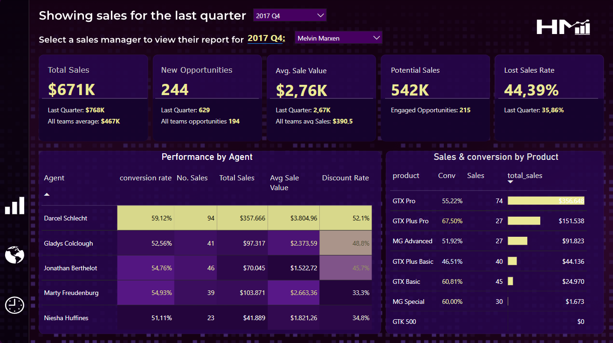
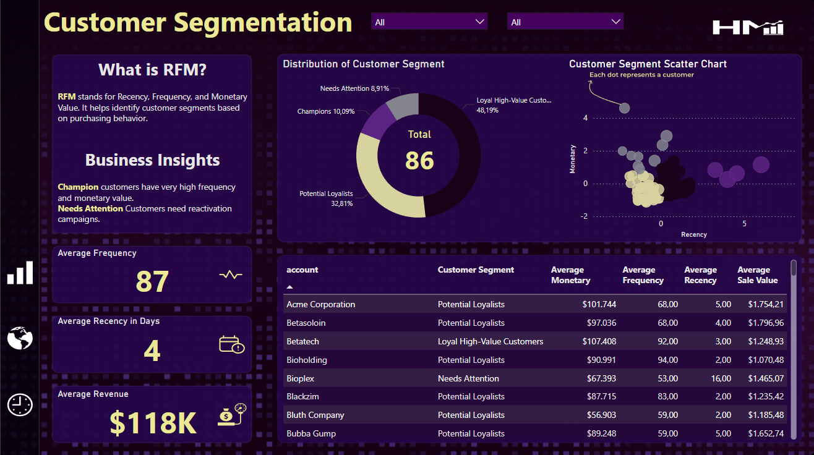
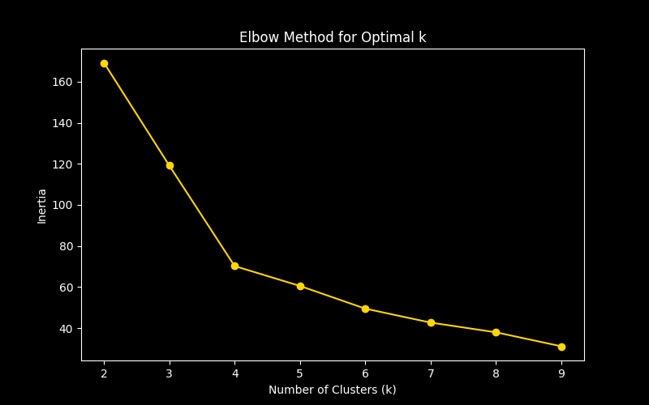
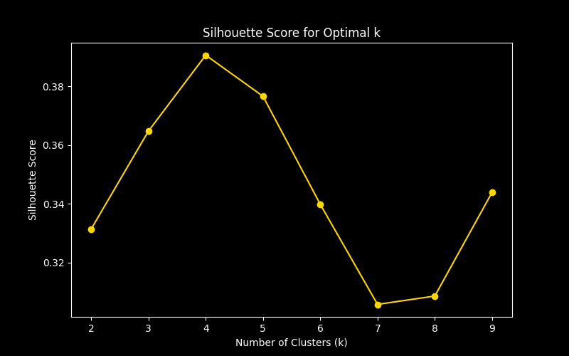
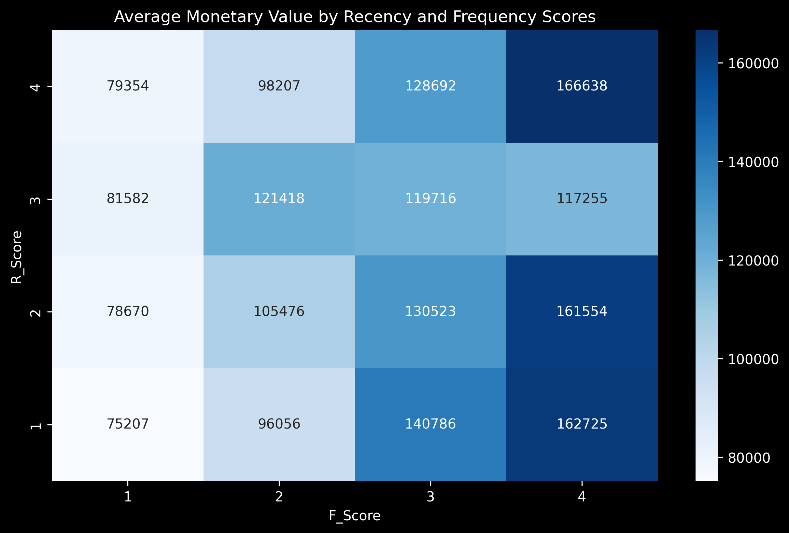
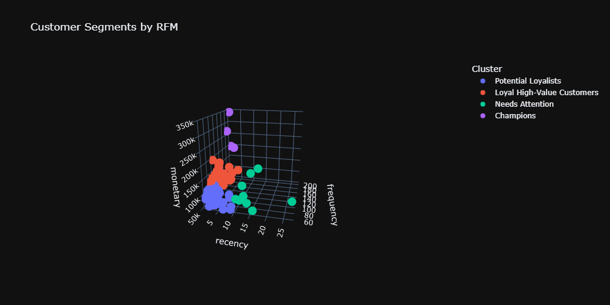

# Customer Segmentation for Targeted Marketing
<div style="display: flex; gap: 20px; flex-wrap: nowrap; justify-content: center;">
  
  
</div>


This project segments customers of an online CRM sales platform using RFM (Recency, Frequency, Monetary) analysis and K-Means clustering to design targeted marketing campaigns.

- Calculated RFM scores to quantify customer value.
- Applied K-Means clustering to identify segments (e.g., high-value, at-risk).
- Visualized segments with heatmaps and 3D scatter plots.
- Explore the dashboard: [Power Bi Report Link](https://app.powerbi.com/view?r=eyJrIjoiN2UxYjJkNzItMTdiNS00ZDUwLWJkYWQtODYxMmRkN2ZlMjcxIiwidCI6IjkxZmE3NDMzLWJkZmUtNDAxYS04NmY3LWYwZDI0OGNlMDgyNiJ9)

# Resources Used
**Python Version:** 3.10<br>
**Packages:** Pandas, NumPy, Scikit-Learn, Matplotlib, Seaborn, Plotly<br>
**Dataset:** [Online CRM Sales Dataset](https://www.kaggle.com/datasets/innocentmfa/crm-sales-opportunities/data)<br>
**Run** ```pip install -r requirements.txt```<br>

# Data Preprocessing
- Removed missing CustomerID rows and negative quantities/prices.
- Calculated TotalPrice (Quantity * UnitPrice).
- Filtered for UK transactions.

# K-Means Clustering
- Standardized RFM values and used Elbow Method/Silhouette Score to select k=4.
- Identified segments: High-Value, Loyal Low-Spend, At-Risk, Inactive.

<div style="display: flex; gap: 20px; flex-wrap: nowrap; justify-content: left;">
  
  
</div>

# RFM Analysis
- **Recency**: Days since last purchase.
- **Frequency**: Number of unique transactions.
- **Monetary**: Total spending.
- Assigned scores (1–4) using quintiles.

<div style="display: flex; gap: 20px; flex-wrap: nowrap; justify-content: ;left;">
  
  
</div>

